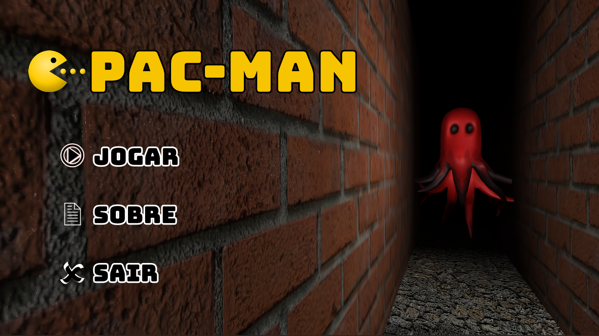

# Projeto 2
> Uma reimaginação do jogo Pac-Man.

## Exemplo de uso

A primeira tela é a do menu, onde é possível selecionar para jogar ou sair (o "Sobre" ainda não funciona). Clicando em jogar, o jogo se inicia.

O jogo é em primeira pessoa, sendo que o _mouse_ é utilizado para movimentar a câmera, e as teclas W/S/A/D para movimentar o personagem..

O objetivo do jogo é recolher todas as pilulas e fugir dos fantasmas.

O personagem principal conta com uma lanterna para ajudar na visibilidade. No teto da fase é possível visualizar o mapa, porém tudo está muito escuro, e para acender uma luz, é necessário acionar o interruptor (tecla E) que fica na parte central do mapa, onde os fantasmas nascem.

Com a luz acesa, é possível jogar normalmente em "primeira pessoa" ou jogar olhando para o teto, dando a sensação de se estar jogando um jogo 2D.

Nas duas laterais centrais existem "portais", sendo que se atravessar de um lado, aparece do outro.

### Todos os requisitos pedidos foram implementados, incluindo os não exigidos, e algumas coisas a mais.

## Faça um jogo em primeira pessoa, no estilo Pac-Man, que tenha os seguintes requisitos:

- Um labirinto com estrutura semelhante à do PAC-MAN do ATARI;

- Quatro personagens não-jogáveis (NPCs) que devem perseguir o personagem principal PC);

- Se os NPCs tocarem o PC, este deve ser destruído;

- Um placar;

- Pílulas espalhadas pelo labirinto. Ao colhê-las, o placar deve ser incrementado;

## Desejável, mas não exigido:

- Uma tela de início e uma de game-over;

- 3 vidas.

- Se o PC pegar todas as pílulas, o labirinto deve voltar a ter todas as pílulas novamente, como se o jogador tivesse passado de fase;

- Quatro power-ups espalhados pelo mapa. Se o PC consumir uma pílula, terá um tempo X em que destruirá o NPC, se tocá-lo (e isto também aumentará o placar). Neste caso, após 10 segundos, um novo NPC deve ser respawnado. 

## Meta

Lucas do Prado Pinto - 1828746 – [@pradoplucas](https://br.linkedin.com/in/pradoplucas) – lucaspinto@alunos.utfpr.edu.br

[Repositório projectGames_Pt2 no GitHub](https://github.com/pradoplucas/projectGames_Pt2) 
